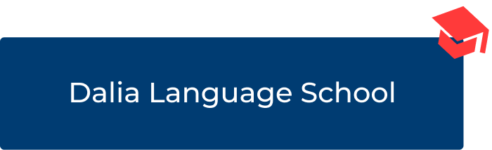
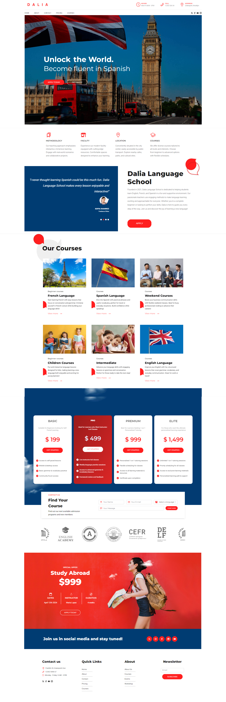

<p align="center" width="100%">
  
</p>

## About the project

This project is a modern, responsive landing page for **Dalia Language School**, built with a focus on performance and smooth user experience. It features sleek animations using Framer Motion to enhance interactivity. The site is developed using **Next.js** for server-side rendering, **TypeScript** for type safety, and **TailwindCSS** for efficient styling.

You can visit the live site here: [Dalia Language School](https://dalia-school.vercel.app/)


<p align="center" width="100%"> 
  
</p>


## Installation

1. Clone the repo

 ```
  https://github.com/AmauriMarcos/language-school.git
 ```

2. Install NPM packages

   ```
   npm install
   ```
   
3. Go to the project folder

   ```
    cd language-school
   ```

4. Start the project

   ```
   npm run dev
   ```
